#Sprawozdanie Laboratorium 1
## Zuzanna Będkowska

##Realizacja zadań:
1. Instalacja Gita:
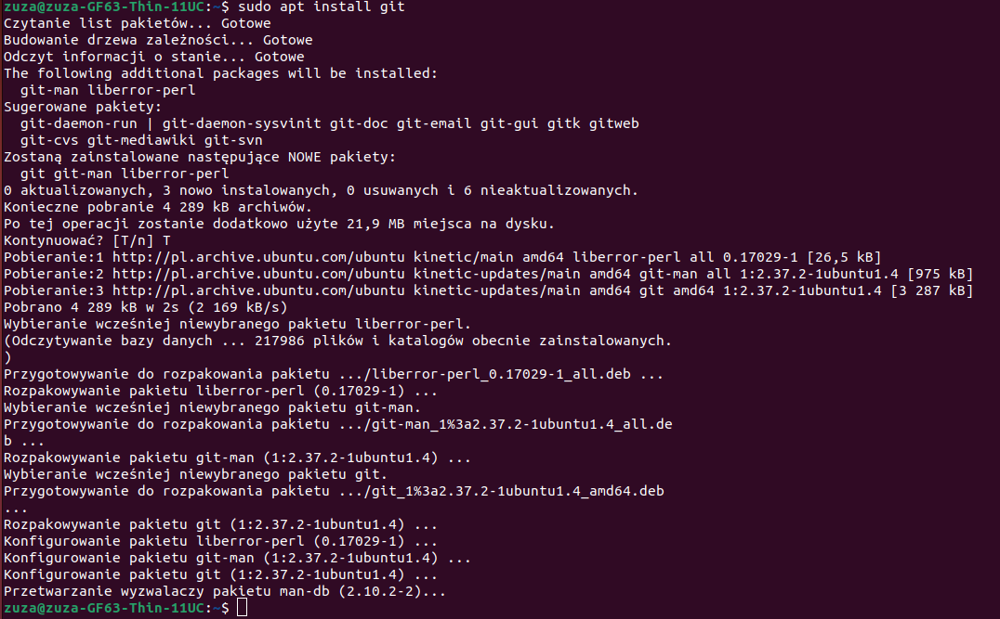
2. Sklonowanie repozytorium za pomocą https:
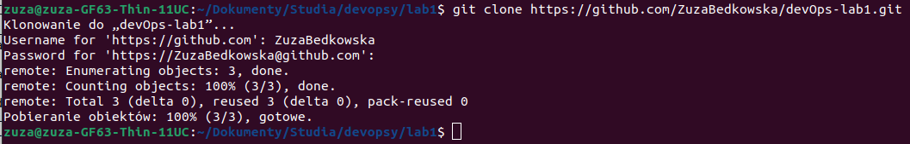
3. Utworzenie kluczy i sklonowanie repozytorium za pomocą SSH
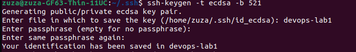
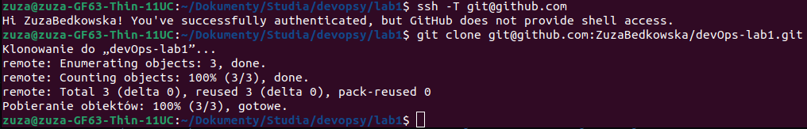
4 i 5. Przełączenie z GR1 na nowoutworzoną gałąź ZB406860
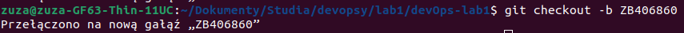
6. Praca na własnej gałęzi:
-Utworzenie nowego folderu o nazwie ZB406860:
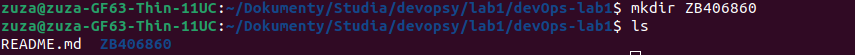
-Napisanie githooka commit-msg, sprawdzającego, czy commit zaczyna się od ZB406860
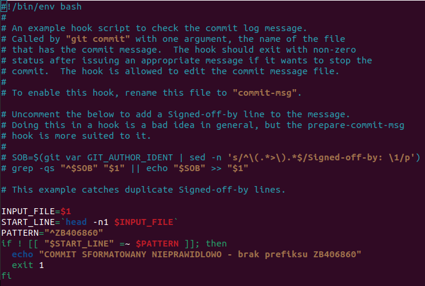
-Dodanie githooka do folderu ZB406860
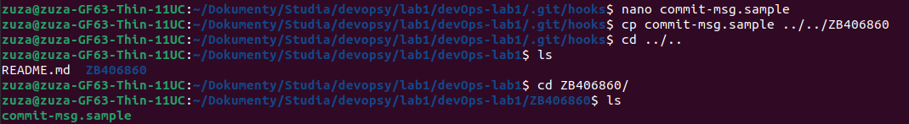
-Dodanie githooka do folderu .git/hooks i zmiana jego nazwy z commit-msg.sample na commit-msg (zmiana ta sprawi, że githook uruchomi się przy wykonaniu każdego commita)
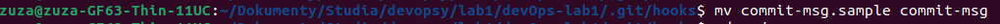
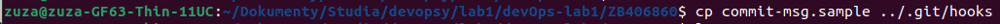
-Dodanie pliku ze sprawozdaniem

-Wykonanie testowych commitów w celu sprawdzenia poprawności działania githooka
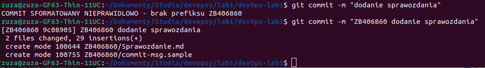
-Dodanie zrzutów ekranu i uzupełnienie treści sprawozdania
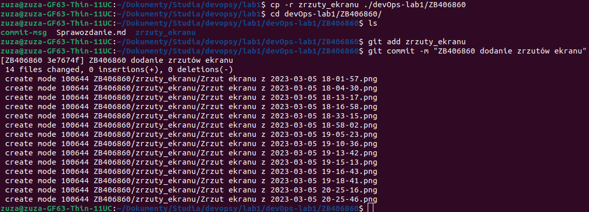
-Wypchnięcie zmian do repozytorium
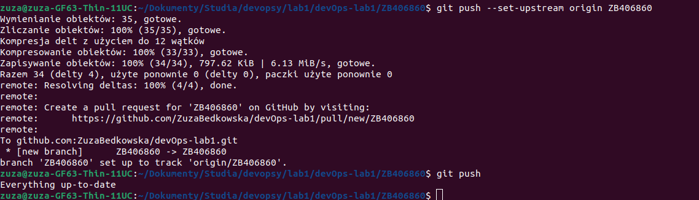

